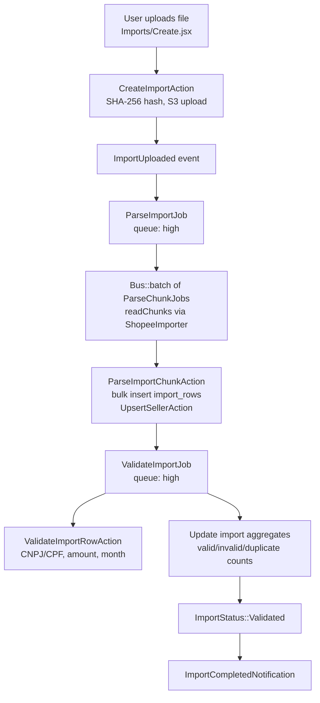
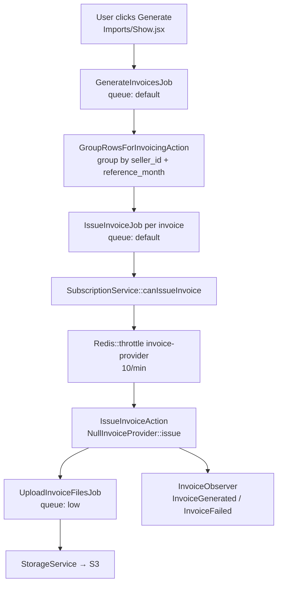
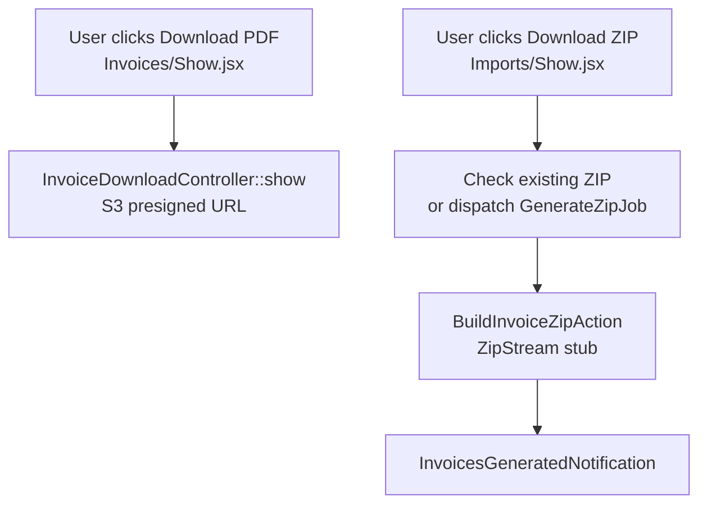

# Architecture

NF-facilitator is a Laravel 12 + Inertia/React SaaS for automating NF-e invoice generation from marketplace commission reports.

---

## Stack

| Layer | Technology | Config / Entry |
|-------|-----------|----------------|
| Backend | PHP 8.4, Laravel 12 | `composer.json`, `bootstrap/app.php` |
| Frontend | React 19, Inertia v2 | `resources/js/app.jsx`, `vite.config.js` |
| CSS | Tailwind 3, shadcn/ui | `tailwind.config.js`, `resources/css/app.css` |
| Database | MySQL 8 | `.env` `DB_*`, `database/migrations/` |
| Cache / Session | Redis | `.env` `REDIS_*`, `CACHE_STORE=redis` |
| Queue | Redis + Horizon | `.env` `QUEUE_CONNECTION=redis`, `config/horizon.php` |
| Storage | AWS S3 | `.env` `AWS_*`, `config/filesystems.php` |
| Billing | Stripe / Cashier | `.env` `STRIPE_*`, `config/plans.php` |
| Auth | Laravel Breeze (React) | `routes/auth.php` |
| Testing | PHPUnit 11, SQLite | `phpunit.xml`, `tests/` |

---

## Folder Structure

### Backend (`app/`)

```
app/
├── Actions/
│   ├── Import/     CreateImportAction, ParseImportChunkAction, ValidateImportRowAction, DetectDuplicateImportAction
│   ├── Invoice/    GroupRowsForInvoicingAction, IssueInvoiceAction, RetryInvoiceAction, BuildInvoiceZipAction
│   └── Seller/     UpsertSellerAction
├── DTOs/           CommissionRowDTO, ImportSummaryDTO, InvoicePayloadDTO, SellerDTO
├── Enums/          ImportStatus, ImportRowStatus, InvoiceStatus, InvoiceFileType, InvoiceEventType, JobExecutionStatus
├── Events/
│   ├── Import/     ImportUploaded, ImportParsed, ImportFailed
│   └── Invoice/    InvoiceGenerated, InvoiceFailed, InvoiceDownloaded
├── Exceptions/     DuplicateImportException, InvalidFileException, InvoiceProviderException, MarketplaceImporterException
├── Http/
│   ├── Controllers/  ImportController, InvoiceController, SellerController, BillingController, …
│   ├── Middleware/   HandleInertiaRequests
│   └── Requests/     StoreImportRequest, GenerateInvoicesRequest, RetryInvoiceRequest, …
├── InvoiceProvider/
│   ├── Contracts/    InvoiceProviderInterface
│   └── Providers/    NullInvoiceProvider (only wired provider)
├── Jobs/           ParseImportJob, ParseChunkJob, ValidateImportJob, GenerateInvoicesJob,
│                   IssueInvoiceJob, UploadInvoiceFilesJob, GenerateZipJob, SendInvoiceEmailJob
├── Listeners/
│   ├── Import/     DispatchParseJob, NotifyUserOfImportResult
│   └── Invoice/    RecordInvoiceEvent, NotifyUserOfInvoiceResult
├── Marketplace/
│   ├── Contracts/    MarketplaceImporterInterface
│   ├── Importers/    ShopeeImporter (CSV only; XLSX TODO)
│   └── Support/      ColumnMapper
├── Models/         User, Import, ImportRow, Invoice, InvoiceFile, InvoiceEvent, InvoiceImportRow,
│                   Seller, Marketplace, AuditLog, JobExecution
├── Notifications/  ImportCompletedNotification, ImportFailedNotification, InvoicesGeneratedNotification, …
├── Observers/      ImportObserver, InvoiceObserver, AuditObserver
├── Policies/       ImportPolicy, InvoicePolicy, SellerPolicy
├── Providers/      AppServiceProvider, HorizonServiceProvider, MarketplaceServiceProvider
└── Services/       StorageService, SubscriptionService, AuditService, DashboardMetricsService, FileValidationService
```

### Frontend (`resources/js/`)

```
resources/js/
├── Pages/
│   ├── Landing.jsx              Public landing page
│   ├── Dashboard/Index.jsx        Summary cards
│   ├── Imports/                   Index, Create, Show, DuplicateWarning
│   ├── Invoices/                  Index, Show
│   ├── Sellers/                   Index, Edit
│   ├── Billing/Index.jsx          Stripe plans
│   ├── Profile/                   Edit + partials
│   └── Auth/                      Login, Register, ForgotPassword, …
├── Components/
│   ├── ui/                        shadcn/ui primitives (Button, Card, Dialog, Table, …)
│   ├── App/                       NfUsageBar
│   ├── DataTable/                 DataTable, DataTablePagination, DataTableToolbar
│   ├── Landing/                   Header, Hero, HowItWorks, Pricing, Footer
│   └── …                          StatusBadge, FileUploadZone, InvoiceTimeline, ProgressBar
├── Layouts/          AppLayout, AuthLayout, GuestLayout
├── hooks/            useImportPoller, useInvoicePoller, useConfirm, useDarkMode
├── lib/              cn.js, formatters.js, validators.js
└── constants/        statuses.js, routes.js
```

### Config

| File | Purpose |
|------|---------|
| `config/nf-facilitator.php` | Chunk size (10k), max file size (50 MB), invoice retries, ZIP TTL (24h), presigned URL TTL (15 min) |
| `config/plans.php` | SaaS tiers: free (5 NF), basic (50 NF), advanced (unlimited) |
| `config/horizon.php` | Queue worker configuration |
| `config/filesystems.php` | S3 disk (default `FILESYSTEM_DISK=s3`) |

---

## Data Flow

### Import Pipeline



**Key files:**
- Upload: `ImportController::store` → `CreateImportAction`
- Parse: `ParseImportJob` → `ParseChunkJob` → `ParseImportChunkAction`
- Validate: `ValidateImportJob` → `ValidateImportRowAction`
- Events: `ImportObserver` fires `ImportParsed` on status → `Validated`

### Invoice Pipeline



**Key files:**
- Trigger: `InvoiceController::generate` → `GenerateInvoicesJob`
- Grouping: `GroupRowsForInvoicingAction` (many-to-one: rows → invoice via `invoice_import_rows` pivot)
- Issuance: `IssueInvoiceJob` → `IssueInvoiceAction` → `InvoiceProviderInterface`
- Files: `UploadInvoiceFilesJob` downloads PDF/XML from provider URLs → S3

### Download Pipeline



---

## Database Schema

### Core Tables

| Table | Key Columns | Relationships |
|-------|------------|---------------|
| `users` | plan, nf_usage_this_month, notification_preferences | hasMany imports, sellers |
| `marketplaces` | slug, importer_class, config (JSON column_map) | hasMany imports |
| `imports` | user_id, marketplace_id, file_hash, status, total_rows, valid_rows, … | hasMany importRows, invoices |
| `import_rows` | import_id, seller_id, seller_document, reference_month, status, invoice_amount | belongsTo import, seller; belongsToMany invoices |
| `sellers` | user_id, tax_document, address_* (split columns) | hasMany importRows, invoices |
| `invoices` | import_id, seller_id, reference_month, amount, status, provider, provider_payload | belongsToMany importRows; hasMany files, events |
| `invoice_import_rows` | invoice_id, import_row_id | Pivot table |
| `invoice_files` | invoice_id, type (pdf/xml/zip), disk, storage_path, expires_at | belongsTo invoice |
| `invoice_events` | invoice_id, event, metadata | belongsTo invoice |
| `audit_logs` | user_id, action, auditable_type/id, old/new values | Polymorphic |
| `job_executions` | job_class, import_id, status, error_message | belongsTo import |

### Cashier Tables

`customers`, `subscriptions`, `subscription_items` (with `meter_event_name`, `meter_id` for usage metering).

Migrations: `database/migrations/2026_07_19_*`.

---

## Queue Hierarchy

| Queue | Jobs | Retry / Backoff |
|-------|------|----------------|
| `high` | ParseImportJob, ParseChunkJob, ValidateImportJob | 3 tries, [30, 120, 300]s |
| `default` | GenerateInvoicesJob, IssueInvoiceJob | 3–5 tries, exponential |
| `low` | UploadInvoiceFilesJob, GenerateZipJob | 2–3 tries |

Horizon dashboard: `/horizon` (gate in `HorizonServiceProvider`).

---

## Extensibility Seams

### Marketplace Importers

```php
// Interface: app/Marketplace/Contracts/MarketplaceImporterInterface.php
// Methods: chunkSize(), readChunks(string $path), mapToCommissionRow(array $raw, Marketplace $m)

// Registration: marketplace.importer_class column (resolved per-import in ParseImportJob)
// Default binding: MarketplaceServiceProvider → ShopeeImporter
// Column mapping: marketplace.config.column_map (see MarketplaceSeeder)
```

### Invoice Providers

```php
// Interface: app/InvoiceProvider/Contracts/InvoiceProviderInterface.php
// Methods: slug(), issue(InvoicePayloadDTO $payload): array

// Current binding: AppServiceProvider → NullInvoiceProvider
// To add a provider: create class, bind in AppServiceProvider, return pdf_url/xml_url in raw payload
```

---

## Frontend Patterns

- **Inertia pages** receive server props; mutations via `useForm().post/patch/delete`
- **Polling:** `useImportPoller` reloads import status; `useInvoicePoller` fetches JSON progress endpoint
- **UI:** shadcn/ui components with Tailwind CSS variables (HSL tokens in `app.css`)
- **Formatting:** pt-BR locale in `lib/formatters.js` (currency, dates, tax documents)
- **Routes:** global `route()` via Ziggy; constants in `constants/routes.js`
- **Status display:** `StatusBadge` + labels from `constants/statuses.js`

---

## Security

- **Auth:** Laravel Breeze with email verification (`auth`, `verified` middleware on app routes)
- **Authorization:** Policies on Import, Invoice, Seller (user_id ownership check)
- **Scoping:** `BelongsToUserScope` global scope on Import, Seller
- **CSRF:** All routes except `stripe/webhook`
- **File validation:** MIME check via `StoreImportRequest` rules; server-side validation in `FileValidationService` (assumption: not fully wired yet)
- **Downloads:** S3 presigned URLs with configurable TTL (15 min default)

---

## Assumptions

- `NullInvoiceProvider` is the only invoice provider; no real NF-e is issued.
- `BuildInvoiceZipAction` creates a DB record but does not stream files into a ZIP yet.
- `ShopeeImporter` handles CSV only; XLSX/XLS support is a TODO.
- Event listeners are auto-discovered by Laravel (no explicit `EventServiceProvider`).
- `DashboardMetricsService` and `FileValidationService` exist but are not yet wired into the main pipeline.
