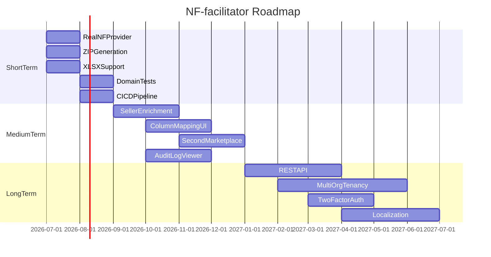

# Roadmap

Short and long-term goals for NF-facilitator.

---

## Current State

The application has a working scaffold matching the `ARCHITECTURE.md` design:

- Full import pipeline (upload → parse → validate → preview)
- Invoice generation pipeline (group → issue → upload files)
- Stripe billing with tiered plans
- React/Inertia frontend with landing page, dashboard, imports, invoices, billing
- Queue infrastructure with Horizon
- Audit logging, notifications, seller registry

**Not yet production-ready:**
- `NullInvoiceProvider` (no real NF-e issuance)
- `BuildInvoiceZipAction` stub (no actual ZIP)
- `ShopeeImporter` CSV-only (no XLSX)
- No domain test coverage
- No CI/CD pipeline

---

## Short-Term (Next 1–2 Sprints)

Goal: **Minimum viable production release for Shopee affiliates.**

| # | Goal | Key Files | Depends On |
|---|------|-----------|-----------|
| 1 | Integrate real NF-e provider | `app/InvoiceProvider/Providers/` | Provider API credentials |
| 2 | Complete ZIP generation | `BuildInvoiceZipAction` | S3 file storage working |
| 3 | XLSX/XLS import support | `ShopeeImporter` | maatwebsite/excel |
| 4 | CNPJ/CPF checksum validation | `ValidateImportRowAction` | — |
| 5 | Domain test suite | `tests/Feature/` | Factories for Import, Invoice, Seller |
| 6 | CI/CD pipeline | `.github/workflows/` | — |
| 7 | Invoice failure notifications | `NotifyUserOfInvoiceResult` | Mail configured |
| 8 | File content validation | `FileValidationService` | — |

**Success criteria:** A user can upload a Shopee commission report, review validated rows, generate real NF-e invoices, download PDF/XML/ZIP, and be billed via Stripe — all covered by automated tests.

---

## Medium-Term (3–6 Months)

Goal: **Polish UX and expand marketplace support.**

| Goal | Description |
|------|-------------|
| Seller enrichment | Integrate Receita Federal CNPJ API to auto-fill address fields |
| Column mapping UI | Let users preview/adjust column mapping before parse commit |
| Duplicate override flow | Wire `DuplicateWarning.jsx` to allow re-importing flagged files |
| Dashboard metrics | Cached aggregates via `DashboardMetricsService` + Redis |
| Sellers in navigation | Add to `AppLayout` NAV_ITEMS |
| Email to sellers | Send PDF/XML directly to seller email after generation (`SendInvoiceEmailJob`) |
| Invoice configuration | Per-marketplace CNAE, service codes, ISS aliquot |
| Import validation rules | User-configurable thresholds (e.g., flag rows > R$ 10,000) |
| Audit log viewer | UI to search/filter audit events |
| Second marketplace | Mercado Livre or Amazon importer implementing `MarketplaceImporterInterface` |

---

## Long-Term (6–12 Months)

Goal: **Platform expansion and enterprise readiness.**

| Goal | Description |
|------|-------------|
| REST API (`/api/v1`) | Sanctum token auth for programmatic uploads and status polling |
| Outbound webhooks | Post-generation events for partner integrations |
| Two-factor authentication | TOTP via Laravel Fortify |
| Multi-organization tenancy | `organizations` table with multiple users per org |
| Localization (i18n) | Laravel translation files + react-i18next (UI currently English, domain Brazil-specific) |
| Virus scanning | ClamAV or cloud scan on uploaded files before parsing |
| Mobile-responsive polish | Optimize import preview and invoice timeline for mobile |
| Analytics dashboard | Historical charts (invoices/month, revenue, failure rates) |
| White-label support | Custom branding per organization |

---

## Milestones

**Assumption:** Timeline is indicative. Priorities may shift based on user feedback and provider integration complexity.

---

## Metrics to Track

| Metric | Source | Target |
|--------|--------|--------|
| Import success rate | `imports.status = validated / total` | > 95% |
| Invoice generation rate | `invoices.status = generated / total` | > 98% |
| Average parse time | `job_executions` for ParseImportJob | < 60s for 10k rows |
| Failed job rate | Horizon failed jobs / total | < 2% |
| Monthly active users | `users` with imports this month | Growth |
| NF-e per user per month | `users.nf_usage_this_month` | Plan-appropriate |
| Churn rate | Stripe subscription cancellations | < 5%/month |

---

## Out of Scope (for now)

- Mobile native apps
- On-premise / self-hosted deployment
- NF-e cancellation / correction flows
- Multi-currency support
- Integration with accounting software (Conta Azul, Omie, …)

These may be reconsidered based on user demand after initial launch.
